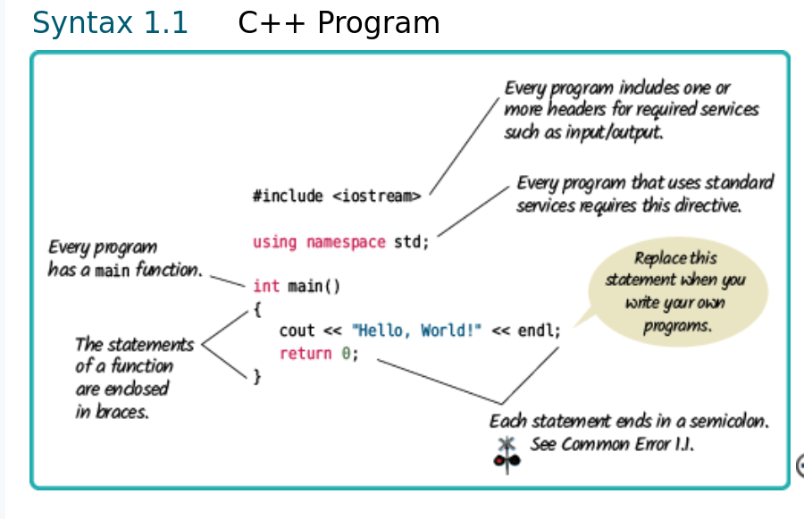
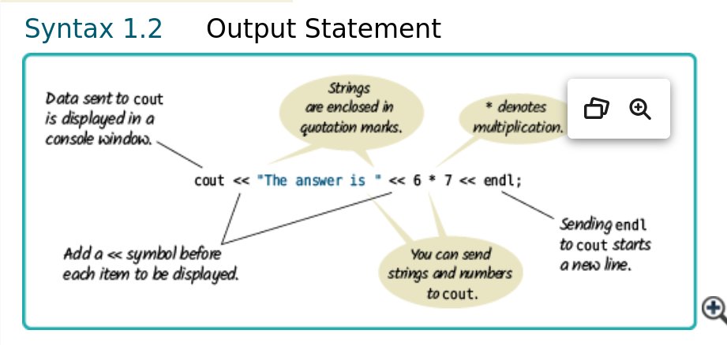

# Chapter 1 Notes

## Summary

- A basic introduction to programming with an emphasis on C++
- 'Anatomy of a computer'
  - CPU, memory, I/O devices,
- Primary v Secondary memory (RAM v HDD) 
  - RAM requires electricity to operate
  - SSD/HHD memory persists when here is no power
- Standards organizations (ISO, ANSI)
  - ensure interoperability across different platforms.
- Flow of a program:
- Editor -> Source Filer ->Compiler -> Machine Code/Library Files -> Linker -> Executable
- Most C++compilers require files to end in an extension of .cpp, .cxx, .cc, or .c,
- Backup files often with multiple directories for the backups
- To solve a problem a program must follow a sequence of steps that are
  - Unambiguous
  - Executable
  - Terminating
  - *** A sequence of steps that are unambiguous, executable, and terminating is called an algorithm***

### Code Break Down

include <iostream> - this is similar to the 'import' statement in python

using namespace std; - Namespaces are used to avoid name collisions. Not covered in this chapter

```c++
//all instruction MUST end with a ';' Not all lines will be complete instructions
int main()  //This is the entry point of the program and every program must have a main function
{
    cout << "Hello World!" << endl; //cout = c out or console output. Similar to print in python. 
        //<< before whatever you send to cout. << endl starts a new line
    return 0; // all main() retun an int. the 'int' before main actually states the return type of the function
}

cout << "Hello \"World\"" // the '\' us tge ESCAPE SEQUENCE and it denotes a literal quote and not the end of a string
// and char immediately following the '\' escape sequence is a literal

cout << "Hello World\n"; // this is the same as "cout << "Hello World << endl; 
```





## Compile Time Error vs Run Time Error

- Compile time errors are usually syntax errors
  - Program will not compile
  - Compiler will point out the error in most cases
- Run time errors are usually logic errors
  - Program will compile but does not behave as expected
  - Spelling mistakes in strings are logic errors
  - Anytime the output is not what you expected, there is a logic error

## Pseudocode
- There are no strict requirements
- Book examples:
  - Use statements such as the following to describe how a value is set or changed:
    - total cost = purchase price + operating cost
    - Multiply the balance value by 1.05.
    - Remove the first and last character from the word.
  - Describe decisions and repetitions as follows:
    - If the balance is less than 0,If total cost 1 < total cost 2
    - While the balance is less than $20,000
    - For each picture in the sequence
  - Indicate results with statements such as:
    - Choose car2.
    - Report year as the answer.
